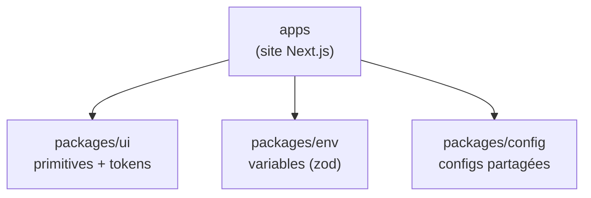
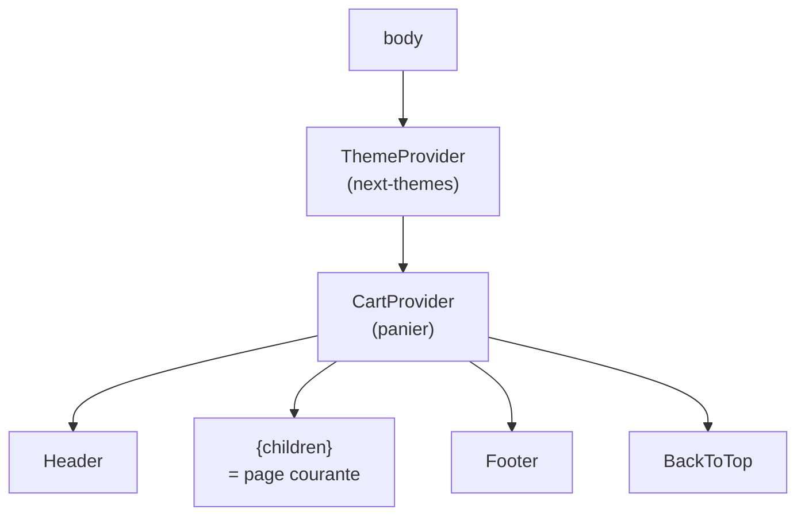
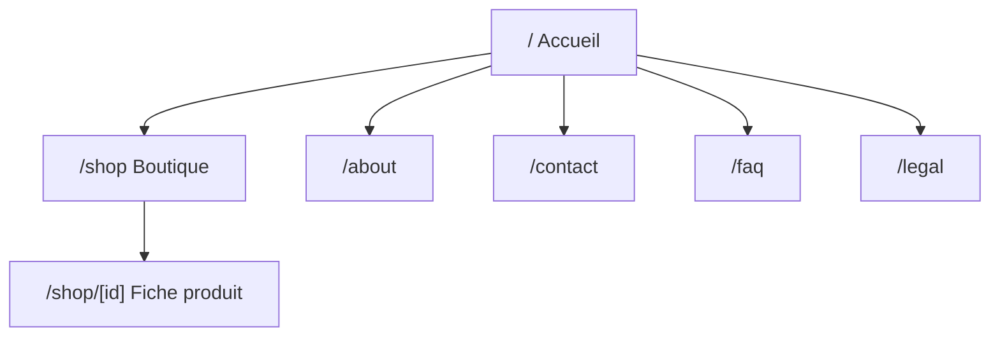
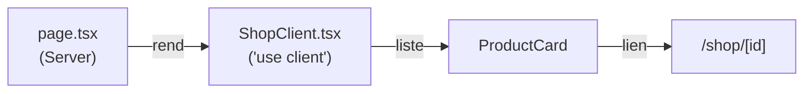
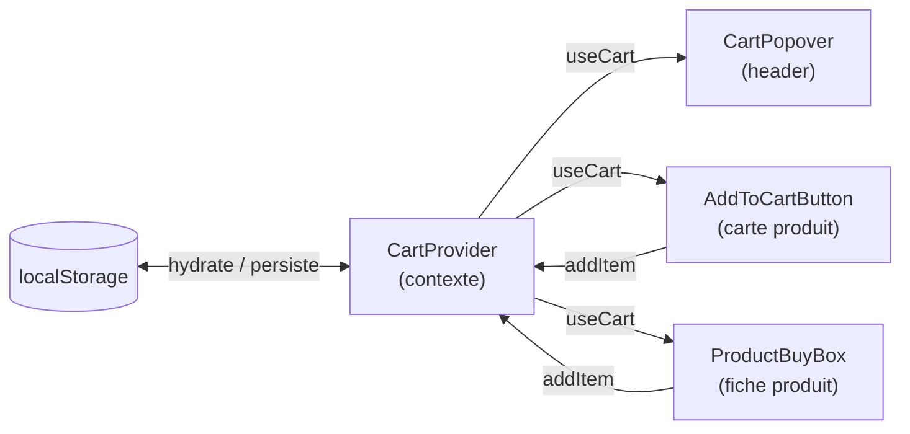

# Architecture

## Monorepo

Géré avec **Turborepo** + **pnpm workspaces**. Le catalogue de versions
(`pnpm-workspace.yaml`) centralise les versions des dépendances partagées.

```text
Workshop_3/
├── apps/              # Application Next.js (le site)
├── packages/
│   ├── ui/            # Primitives shadcn/ui + tokens de design partagés
│   ├── env/           # Validation des variables d'environnement (zod)
│   └── config/        # Configurations partagées (TS, etc.)
├── docs/              # Cette documentation
├── turbo.json         # Pipeline de tâches (dev, build, check-types)
└── pnpm-workspace.yaml
```

Scripts racine (délégués à Turbo) : `dev`, `build`, `start`, `check-types`.



## Application (`apps/`)

Next.js 16 avec **App Router**. Alias d'imports (voir `apps/tsconfig.json`) :

- `@/*` → `apps/src/*`
- `@e-commerce/ui/*` → `packages/ui/src/*`

```text
apps/src/
├── app/               # Routes (App Router)
│   ├── layout.tsx     # Layout racine : polices, providers, header, footer
│   ├── page.tsx       # Accueil
│   ├── loading.tsx    # État de chargement global
│   ├── error.tsx      # Frontière d'erreur
│   ├── not-found.tsx  # Page 404
│   ├── about/         # À propos
│   ├── contact/       # Contact (+ ContactForm)
│   ├── faq/           # FAQ (+ FaqClient)
│   ├── legal/         # Mentions légales (+ LegalClient)
│   └── shop/          # Boutique (+ ShopClient)
│       └── [id]/      # Fiche produit (+ ProductBuyBox)
├── components/        # Composants React (voir ci-dessous)
└── data/              # Données statiques typées
```

### Composition du layout

`layout.tsx` monte les providers une fois, puis le chrome global autour de la
page courante (`{children}`) :



### Routes

| Route      | Page             | Composant client associé                    |
| ---------- | ---------------- | ------------------------------------------- |
| `/`        | Accueil          | — (sections)                                |
| `/about`   | À propos         | —                                           |
| `/contact` | Contact          | `ContactForm`                               |
| `/faq`     | FAQ              | `FaqClient` → `FaqTabs`, `FaqAccordion`     |
| `/legal`   | Mentions légales | `LegalClient` → `LegalTabs`, `LegalContent` |
| `/shop`    | Boutique         | `ShopClient` → `ProductCard`                |
| `/shop/[id]` | Fiche produit  | `ProductBuyBox` (+ `ProductCard` liés)      |

Convention App Router : chaque `page.tsx` est un **Server Component** ; la
logique interactive (état, filtres, formulaires) est déléguée à un composant
`*Client.tsx` marqué `"use client"`.



Exemple de frontière Server / Client (boutique) :



## Composants (`apps/src/components/`)

Organisés **par domaine**, fichiers en **PascalCase** :

```text
components/
├── cart/         AddToCartButton · CartPopover · CartProvider
├── faq/          FaqAccordion · FaqTabs
├── layout/       Header · Footer · BackToTop · Breadcrumbs
├── legal/        LegalContent · LegalTabs
├── product/      ProductCard
├── providers/    Providers · ThemeProvider
├── sections/     HeroSection · FeaturedProductsSection · ServicesSection
│                 ContactCtaSection · MarqueeBand
└── ui/           Loader · ModeToggle · StarRating
```

- **`providers/`** : `Providers` agrège `ThemeProvider` (next-themes) et
  `CartProvider`. Monté une fois dans `app/layout.tsx`.
- **`cart/`** : état du panier via contexte React (`CartProvider` →
  `useCart`). `CartPopover` (header) et `AddToCartButton` (carte produit)
  consomment ce contexte.
- **`sections/`** : blocs de page composables, réutilisés entre l'accueil et
  `/about` (ex. `ServicesSection`).
- **`product/`** : `ProductCard`, carte produit cliquable (vers `/shop/[id]`)
  affichant visuel, note et bouton d'ajout au panier.
- **`layout/`** : chrome global injecté dans le layout racine. Inclut
  `Breadcrumbs`, fil d'Ariane réutilisable (`items: Crumb[]`).
- **`ui/`** : petits composants présentiels génériques, dont `StarRating`
  (note en étoiles).

Flux de données du panier (contexte React + persistance) :



## Données (`apps/src/data/`)

Données statiques typées, sans backend. Chaque fichier exporte ses constantes
et ses types.

| Fichier         | Exports principaux                                                                           |
| --------------- | -------------------------------------------------------------------------------------------- |
| `shop.data.ts`  | `PRODUCTS`, `SHOP_CATEGORIES`, `SHOP_SORTS`, types `Product`, `ShopCategoryId`, `ShopSortId`. `Product` inclut `inStock`, `rating`, `reviewCount` |
| `faq.data.ts`   | `FAQ_TABS`, `FAQ_CONTENT`, types `FaqItem`, `FaqTabId`                                       |
| `legal.data.ts` | `TABS`, `CONTENT`, type `TabId`                                                              |

## UI partagée (`packages/ui/`)

Primitives shadcn/ui consommées via `@e-commerce/ui/components/*` :
`button`, `card`, `checkbox`, `dropdown-menu`, `input`, `label`, `popover`,
`skeleton`, `sonner`.

Les **tokens de design** (couleurs OKLCH, thèmes clair/sombre, polices) sont
définis dans `packages/ui/src/styles/globals.css`.
