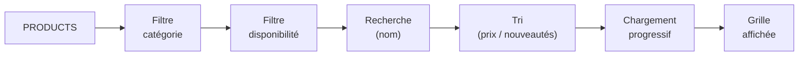
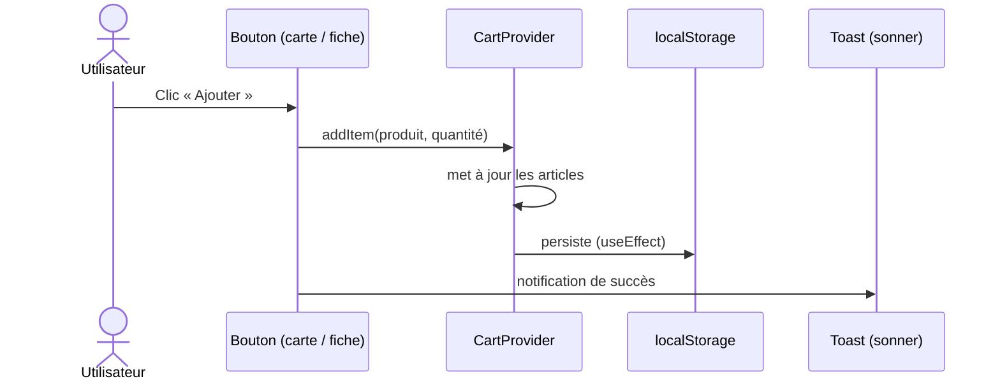

# Fonctionnalités

Vue d'ensemble des fonctionnalités du site, par domaine. Le site fonctionne
**sans backend** : les données sont statiques (`apps/src/data/`) et les actions
sensibles (paiement, envoi d'e-mail) sont simulées côté client.

## Boutique (`/shop`)

- **Catalogue** de produits issus de `shop.data.ts`.
- **Recherche** par nom de création (champ avec effacement rapide).
- **Filtre par catégorie** (onglets).
- **Filtre par disponibilité** (bascule « En stock »).
- **Tri** : nouveautés, prix croissant, prix décroissant.
- **Densité de la grille** réglable (3 ou 4 colonnes, ≥ desktop).
- **Chargement progressif** : affichage par lots via un bouton « Voir plus »
  (réinitialisé à chaque changement de filtre).
- **Compteur** de créations + nombre d'articles **en rupture de stock**.
- **État vide enrichi** : icône, message contextuel (reprend le terme
  recherché) et CTA **« Réinitialiser les filtres »**.
- **Fil d'Ariane** (`Accueil › Boutique`).
- Composant `ProductCard` (cliquable vers la fiche produit) : visuel, **note
  étoilée**, prix et bouton **Ajouter au panier**.

> Logique dans `app/shop/ShopClient.tsx`.

Pipeline appliqué à la liste des produits :

## Page produit (`/shop/[id]`)

- Route **dynamique**, une fiche par produit.
- Pré-génération statique (`generateStaticParams`) et **métadonnées par
  produit** (`generateMetadata` : titre + description).
- **404** (`notFound()`) si l'identifiant est inconnu ou non numérique.
- Contenu : grand visuel, tag, catégorie, **note étoilée**, prix, description,
  tableau de **caractéristiques** (essence, catégorie, finition, disponibilité).
- **Sélecteur de quantité** + ajout au panier (`ProductBuyBox`) ; bouton
  « Indisponible » désactivé si en rupture.
- **Produits liés** (même catégorie).
- **Fil d'Ariane** (`Accueil › Boutique › <produit>`).

> `app/shop/[id]/page.tsx` (serveur) + `app/shop/[id]/ProductBuyBox.tsx` (client).

## Panier

- État global via **contexte React** (`CartProvider` / `useCart`).
- **Persistance** dans `localStorage` (le panier survit au rechargement).
- Actions : `addItem`, `removeItem`, `updateQuantity`, `clear`.
- Valeurs dérivées : `itemCount`, `subtotal`.
- **`CartPopover`** dans le header : aperçu des articles et sous-total.
- ⚠️ Pas de tunnel de paiement (démonstration).

> `components/cart/CartProvider.tsx`, `CartPopover.tsx`, `AddToCartButton.tsx`.

Parcours d'ajout au panier :

## Contact (`/contact`)

- Formulaire (nom, e-mail, sujet, message).
- **Validation** côté client avec **zod**.
- **Accessibilité** : `aria-invalid`, messages d'erreur liés
  (`aria-describedby`), `role="alert"`.
- **Retour utilisateur** via un toast **sonner** en cas de succès.
- ⚠️ Pas d'envoi réel (succès simulé).

> `app/contact/ContactForm.tsx`.

## FAQ (`/faq`)

- Navigation par **onglets** thématiques (`FaqTabs`).
- Réponses en **accordéon** dépliable (`FaqAccordion`).
- Contenu depuis `faq.data.ts`.

## Mentions légales (`/legal`)

- Contenu organisé en **onglets** (`LegalTabs` + `LegalContent`).
- Contenu depuis `legal.data.ts`.

## À propos (`/about`)

- Présentation de l'atelier et de la créatrice.
- **Section Services** détaillée (`ServicesSection`) : étapes, repères
  pratiques (délai, tarif) et **deux CTA par service** (principal + secondaire),
  empilés en mobile et alignés en desktop.

## Accueil (`/`)

Composée de sections réutilisables : `HeroSection`,
`FeaturedProductsSection`, `ServicesSection`, `ContactCtaSection`,
`MarqueeBand`.

## Transversal

- **Thème clair / sombre** via `next-themes` (`ModeToggle` dans le header).
- **Header responsive** avec menu mobile.
- **Bouton « retour en haut »** (`BackToTop`).
- **États de route** : chargement (`loading.tsx`), erreur (`error.tsx`),
  page 404 (`not-found.tsx`).
- **Design responsive** mobile-first (voir [conventions](./conventions.md#styles)).
