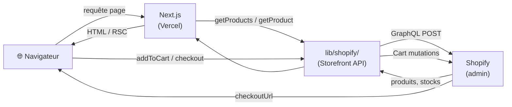
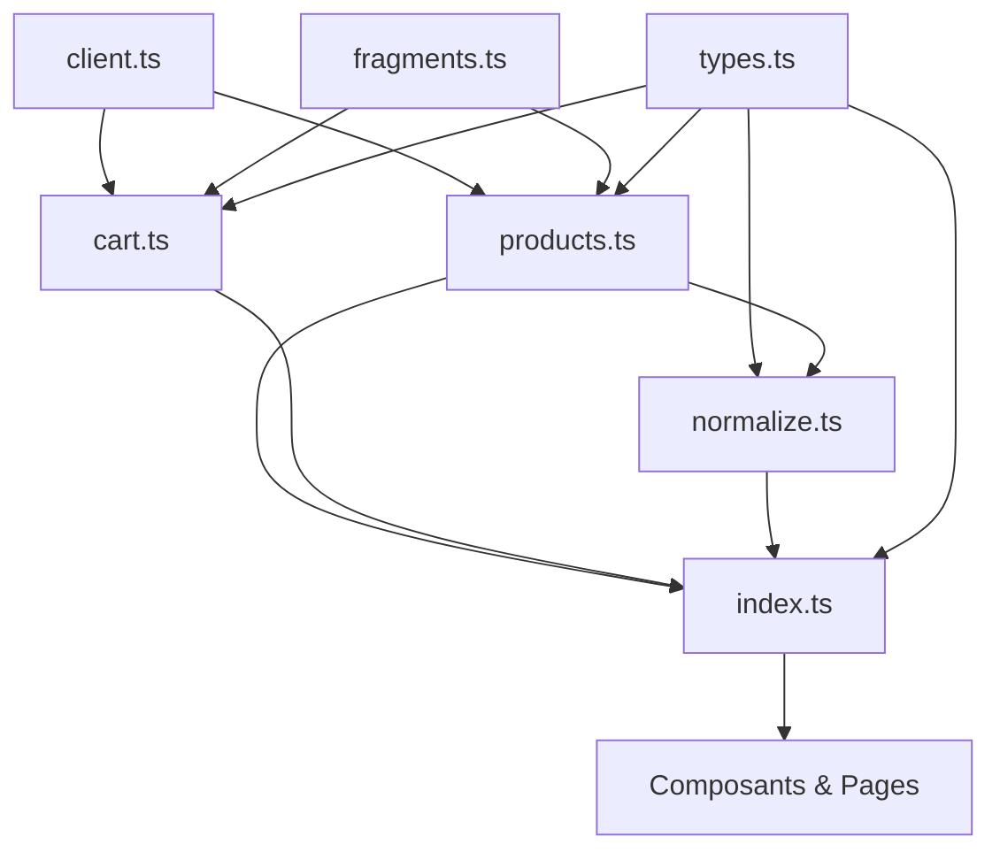
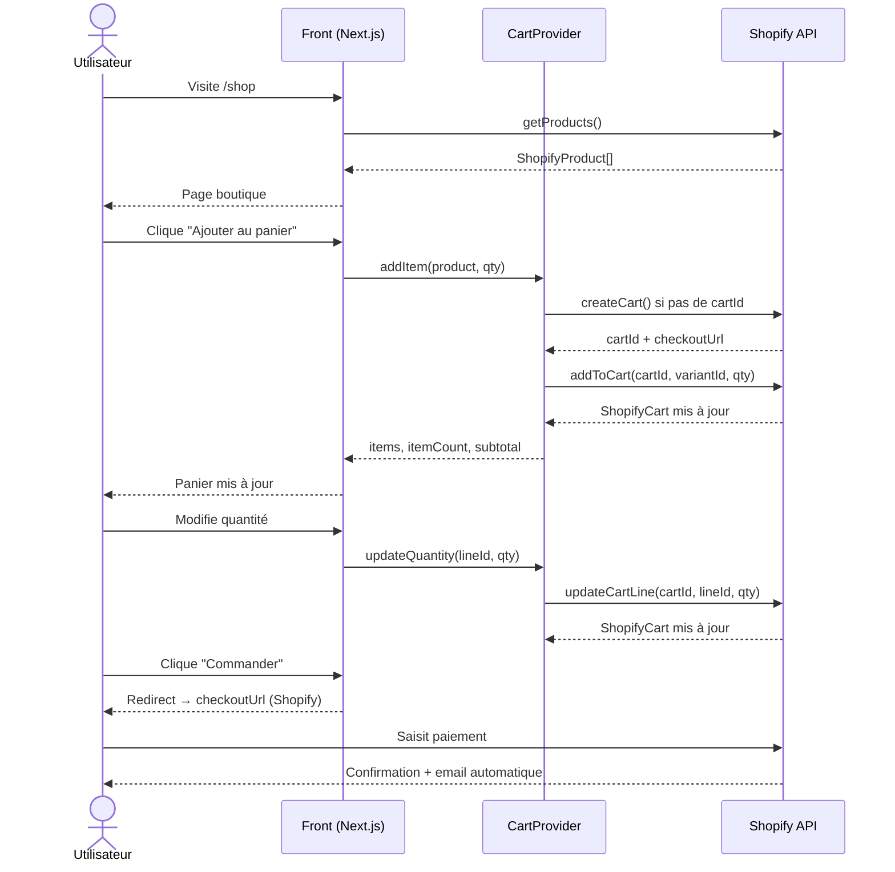

# Intégration Shopify

## Vue d'ensemble

Le front Next.js se connecte à Shopify via la **Storefront API** (GraphQL).
Shopify joue le rôle de back-office : produits, stocks, commandes et paiements.
Le front gère uniquement l'UI — le checkout est délégué à Shopify.



---

## Configuration

### Variables d'environnement

Définies dans `apps/.env` et validées par `packages/env/src/web.ts` (Zod) :

```env
NEXT_PUBLIC_SHOPIFY_STORE_DOMAIN=xxx.myshopify.com
NEXT_PUBLIC_SHOPIFY_STOREFRONT_TOKEN=xxxx
```

Le token est le **Storefront API access token** public (canal Headless dans l'admin Shopify).
Il est préfixé `NEXT_PUBLIC_` car utilisé côté client pour les mutations panier.

### Canal Headless Shopify

Le token est généré via :
`Admin Shopify → Canaux de vente → Headless → Ma Boutique Headless → Storefront API → Gérer`

Permissions activées :

- `unauthenticated_read_product_listings`
- `unauthenticated_read_product_inventory`
- `unauthenticated_read_checkouts`
- `unauthenticated_write_checkouts`

---

## Structure des fichiers

```
apps/src/lib/shopify/
├── types.ts       — Types TypeScript (ShopifyProduct, ShopifyCart, NormalizedProduct…)
├── client.ts      — Fonction générique shopifyFetch (POST GraphQL)
├── fragments.ts   — Fragments GraphQL réutilisables (PRODUCT_FRAGMENT, CART_FRAGMENT)
├── products.ts    — getProducts(), getProduct(handle)
├── cart.ts        — createCart(), getCart(), addToCart(), updateCartLine(), removeCartLine()
├── normalize.ts   — normalizeProduct() : ShopifyProduct → NormalizedProduct
└── index.ts       — Re-exports publics
```

Tout le reste du projet importe depuis `@/lib/shopify` (via l'index).



---

## Types principaux

### `ShopifyProduct`

Réponse brute de la Storefront API. Contient `handle`, `title`, `variants`, `metafields`, etc.

### `NormalizedProduct`

Format normalisé utilisé par tous les composants front :

```ts
type NormalizedProduct = {
  id: string;
  handle: string;       // slug URL (/shop/[handle])
  name: string;
  description: string;
  price: number;        // float en EUR
  availableForSale: boolean;
  category: string;     // extrait des tags Shopify
  tag: string;          // label affiché (ex: "Best-seller")
  wood: string;         // metafield custom.wood
  emoji: string;        // metafield custom.emoji (fallback si pas d'image)
  bg: { light: string; dark: string }; // metafields custom.bg_light / bg_dark
  image: string | null; // featuredImage.url
  variantId: string;    // ID de la première variante (pour le panier)
  rating?: number;
  reviewCount?: number;
};
```

### `ShopifyCart`

Réponse brute du panier Shopify. Contient `id`, `checkoutUrl`, `lines`, `cost`.

---

## Metafields produit

Les données spécifiques au projet sont stockées en metafields Shopify (namespace `custom`) :

| Clé        | Type               | Usage                            |
| ---------- | ------------------ | -------------------------------- |
| `wood`     | `single_line_text` | Essence du bois (ex: "Chêne")    |
| `emoji`    | `single_line_text` | Emoji fallback si pas de photo   |
| `bg_light` | `single_line_text` | Couleur fond carte (mode clair)  |
| `bg_dark`  | `single_line_text` | Couleur fond carte (mode sombre) |

Les couleurs sont au format `oklch(...)`.

---

## Catégories et tags produit

Les catégories sont définies par les **tags Shopify** du produit.
Tags reconnus comme catégorie : `decoration`, `cuisine`, `mobilier`, `sculpture`.

Les labels affichés (ex: "Best-seller") sont également des tags Shopify.
Tags reconnus : `nouveau`, `best-seller`, `coup de cœur`, `artisanal`, `fait main`, `pièce unique`.

---

## Flux panier

Le `CartProvider` (`apps/src/components/cart/CartProvider.tsx`) est branché sur la Shopify Cart API.
Le `cartId` et le `checkoutUrl` sont persistés en `localStorage` (`shopify_cart_id` / `shopify_cart_url`).
Au montage, le cart est rechargé depuis Shopify via `getCart()` — s'il a expiré, on repart de zéro.



---

## Page d'accueil

`FeaturedProductsSection` (`apps/src/components/sections/FeaturedProductsSection.tsx`) est un Server Component qui fetch les 4 premiers produits Shopify et les affiche via `ProductCard`.

Si aucun produit n'est disponible dans Shopify, la section n'est pas rendue (`return null`).

---

## Images produit

Les images sont servies par `cdn.shopify.com`, autorisé dans `apps/next.config.ts` :

```ts
images: {
  remotePatterns: [{ protocol: "https", hostname: "cdn.shopify.com" }],
}
```

`ProductCard` et la page produit affichent l'image Shopify si disponible, sinon l'emoji en fallback.

---

## API endpoint

```
https://{STORE_DOMAIN}/api/2025-01/graphql.json
```

Version API : `2025-01` (stable, mise à jour trimestrielle Shopify).
